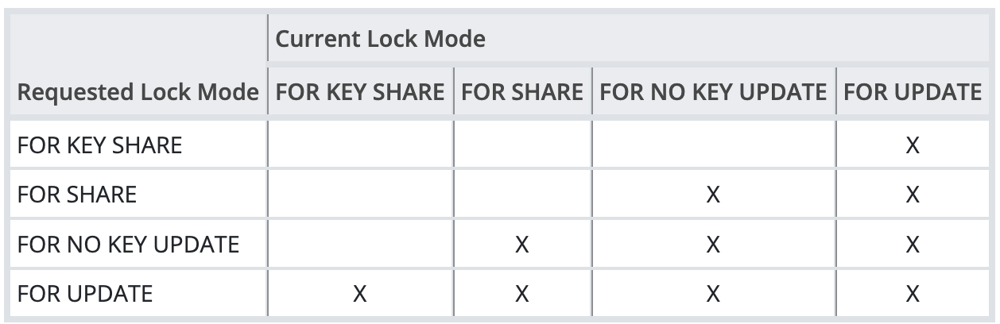
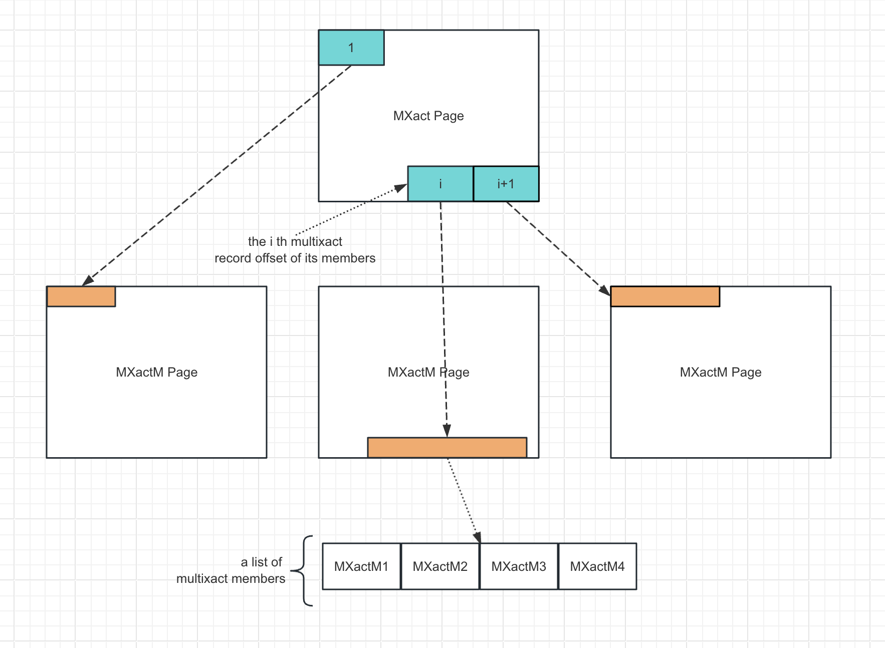

## Background
- Why is `multi-transaction-log` #SLRU_IMPLEMENT
  * Since many transactions can have the shared lock on a same tuple simultaneously but there is no space to record these transactions in the tuple header, we'd better to manage a specific **shared space** to recording the transactions that holding the tuple-level locks.
  * A shared memory space doesn't seem OK since one transaction can access tons of tuple which is unadvisable to store them in memory. So the only solution is recording in disk
  * So locking a row might cause a disk write
- Four kind of locks:
  id:: 65844328-bef2-44af-8583-d61849a30ab1
  * From [Official Docs](https://www.postgresql.org/docs/current/explicit-locking.html#LOCKING-ROWS) , PG has four kinds of tuple-level locks.
  * 
  * `FOR UPDATE` : acquired by `delete` or `UPDATE` that modifies the values of certain columns
  * have a **unique index** on them that can be used in a foreign key
  * `FOR NO KEY UPDATE`: acquired by or `UPDATE` that expect the situation above
  * `FOR SHARE` : #TODO
  * `FOR KEY SHARE` : #TODO 
  
  #TODO  let's see `heapam` first before studying the `multixact`
- ## Low level Design
  - ### backend
    - What's `MXact`:
      Different from `xid` as a transaction level concept,  `multi-transaction-id(MXact)` is a `tuple` level concepts.  When there may be a conflict at tuple, that is deciding the `xmax` value , a `MXact` is generated with tuple. The `Mxact` relates to an array of `xid`s which are accessing the tuple an their lock types.
    - So we call the the transaction with its lock type as `multi transaction member(MXactM)`
      - ```C
        typedef struct MultiXactMember
        {
        	TransactionId xid;
        	MultiXactStatus status;
        } MultiXactMember;
        ```
    - The `MultiXactStatus` is the lock type ((65844328-bef2-44af-8583-d61849a30ab1))
      - ```C
        typedef enum
        {
        	MultiXactStatusForKeyShare = 0x00,
        	MultiXactStatusForShare = 0x01,
        	MultiXactStatusForNoKeyUpdate = 0x02,
        	MultiXactStatusForUpdate = 0x03,
        	/* an update that doesn't touch "key" columns */
        	MultiXactStatusNoKeyUpdate = 0x04,
        	/* other updates, and delete */
        	MultiXactStatusUpdate = 0x05
        } MultiXactStatus;
        ```
  - ### Two [[slru]] structure:
    - As mentioned above, we need to maintain every `MXactM` lists for each `MXact`, The logical implement is below:
    - 
    - `Mxact` Page:
      Similar to clog, one `mxact` occupy 32 bits, so `mxact` can fill the page perfectly
    - `MxactM` Page:
      It is a bit more complex, since we need a external byte for each `xid` attribute. To avoid alignment issues, we bind four `MxactM` as a group(20 bytes). Thus, with 8kB BLCKSZ, we keep 409 groups er page.  This wastes 12 bytes per page, but that's OK.
  - ### Control dat: `MultiXactStateData`
    -
- ## others
  - ```
    heapam_tuple_delete
    .   heapam_tuple_lock_internal
    .       heap_lock_tuple
    .           if (infomask & HEAP_XMAX_IS_MULTI)
                GetMultiXactIdMembers
    ```