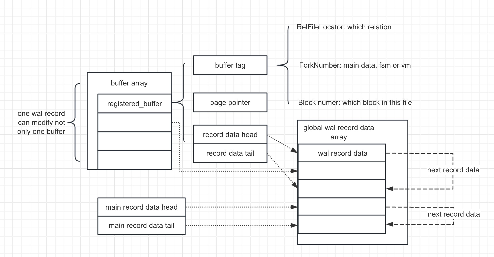

- 
- ## XLogRegisterBuffer
  - just to record a buffer
  - ```
    XLogRegisterBuffer
      regbuf = &registered_buffers[block_id];
      BufferGetTag(buffer, &regbuf->rlocator, &regbuf->forkno, regbuf->block);
      regbuf->page = BufferGetPage(buffer);
      regbuf->flags = flags;
      regbuf->rdata_tail = (XLogRecData *) &regbuf->rdata_head;
      regbuf->rdata_len = 0;
      gbuf->rdata_tail = (XLogRecData *) &regbuf->rdata_head;
      regbuf->rdata_len = 0;
    ```
- ## XLogRegisterBlock
  - ```
    void
    XLogRegisterBlock(uint8 block_id, RelFileLocator *rlocator, ForkNumberforknum,
                      BlockNumber blknum, Page page, uint8 flags)
    ```
  - value we need from parameters
- ## XLogRegisterData
  - add record to the main chunk
  - ```
    XLogRegisterData
    rdata = &rdatas[num_rdatas++];
    rdata->data = data;
    rdata->len = len;
    mainrdata_last->next = rdata;
    mainrdata_last = rdata;
    mainrdata_len += len;
    ```
- ## XLogRegisterBufData
  - like `XLogRegisterData` but register with thespecific buffer
  - ```
    XLogRegisterBufData
      regbuf = &registered_buffers[block_id];
      rdata = &rdatas[num_rdatas++];

      rdata->data = data;
      rdata->len = len;

      regbuf->rdata_tail->next = rdata;
      regbuf->rdata_tail = rdata;
      regbuf->rdata_len += len;
    ```