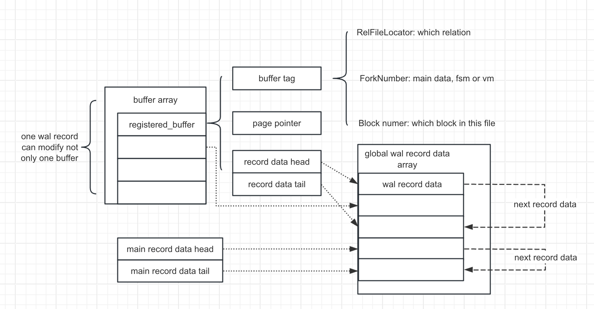

# wal record
  - high level glance
    id:: 65831e78-968c-418d-a401-f9a4afdd1587
    - 
  - Logically, a `WAL` record must contains the three parts below:
    - Which page to modify.(An unique ID, See [[block]]  and [[relfilelocator]] )
      logseq.order-list-type:: number
    - The kind of `WAL`. Different kinds of `WAL` have different modification methods
      logseq.order-list-type:: number
    - The way to modify the page
      logseq.order-list-type:: number
  - Unique page ID
    - For heap pages: The three below attributes can specify a concrete page
    - `relfilelocator`: which relation
    - `block number`: page offset
    - `forknumber`: type -- that is #vm, #fsm or main data
  - See [[wal-insert]] for how the unique id is record
  - 